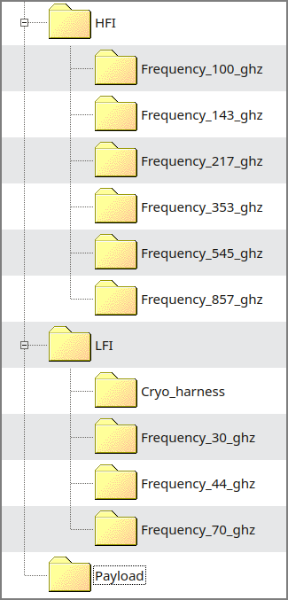
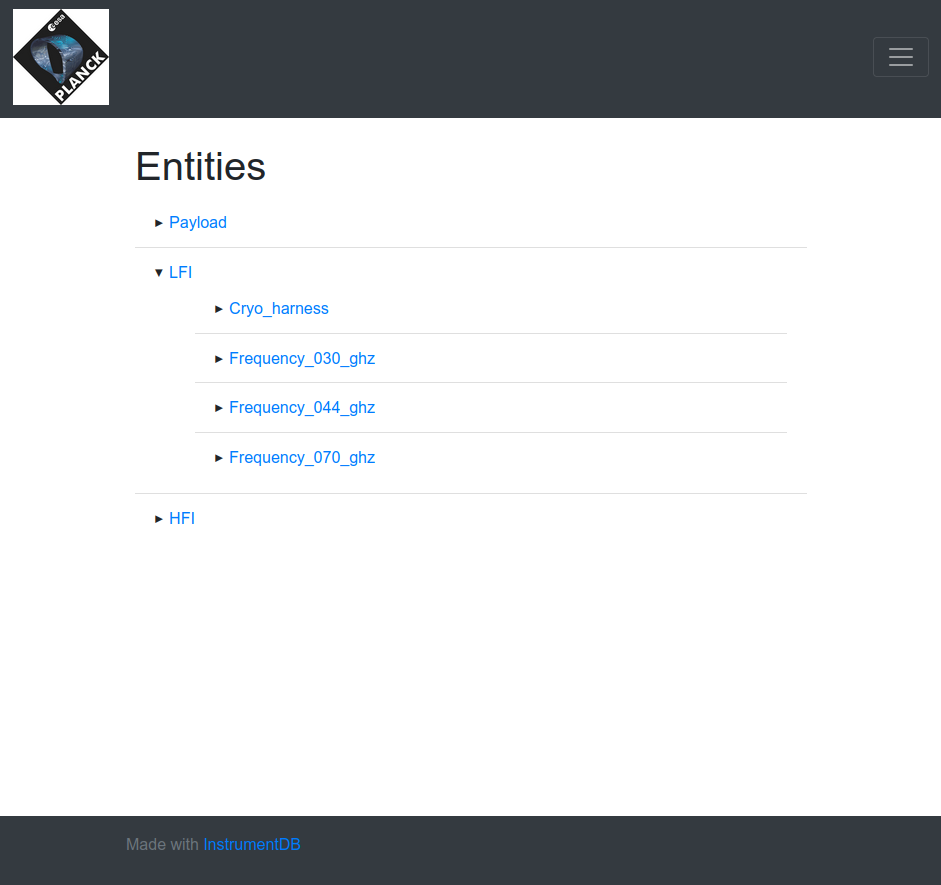
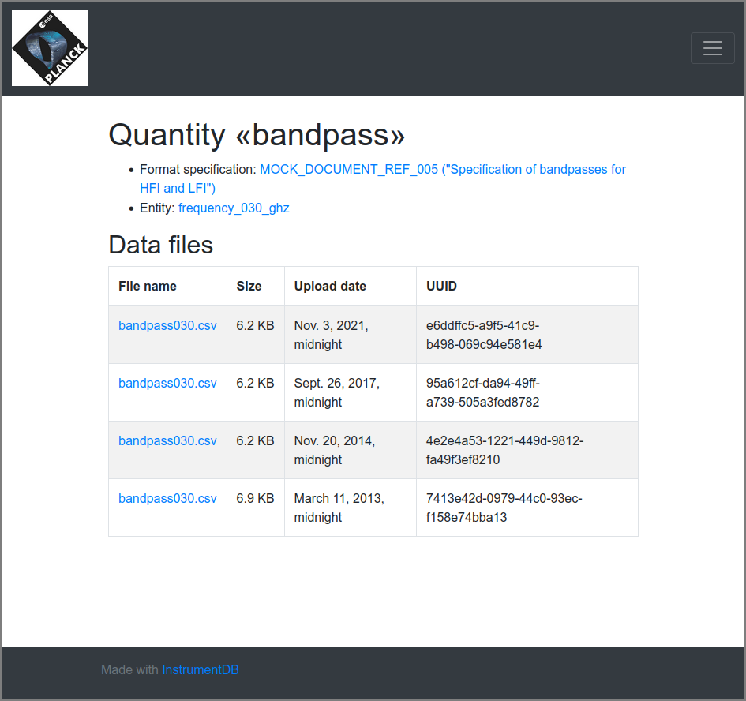
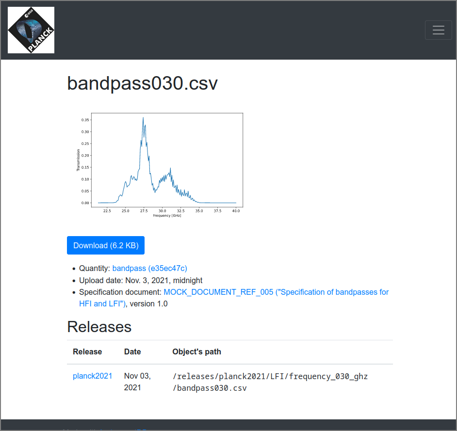
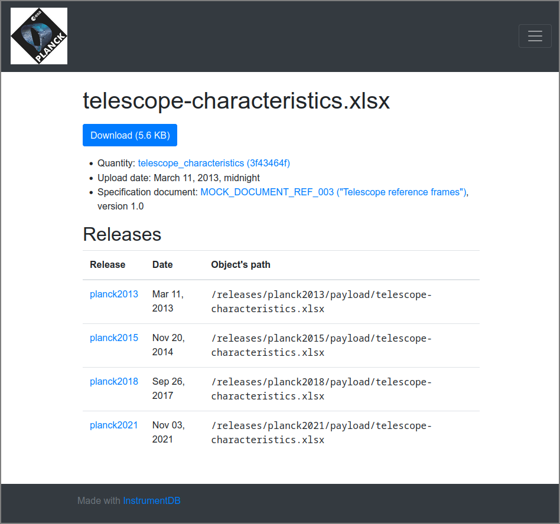

# Fill an InstrumentDB instance with mock ESA Planck specifications

This set of scripts is an example that shows how to use [InstrumentDB](https://github.com/ziotom78/instrumentdb) to create a database containing some details about the [ESA Planck](https://www.esa.int/Science_Exploration/Space_Science/Planck) space observatory.

[InstrumentDB](https://github.com/ziotom78/instrumentdb) is a web-based database that keeps information about the specifications of a scientific instrument. It is able to keep these specifications organized in a tree and preserve the history of each of them.

Filling a running instance of InstrumentDB is a task that should be automatized as much as possible: the number of entities that make up a modern scientific instrument is usually large, and to ensure that information can be retrieved quickly the depth of the tree of entities is usually large.

The scripts in this repository represent one possible way to automatize the task of creating the entity tree and uploading the data files, but the method employed here is surely not unique! Consider this repository more as an example rather than the “one and only way to use InstrumentDB”.

**Note:** This repository is **not** part of any of the official Planck data releases, and the reference to Planck is just for didactical purposes. The usage of the Planck logo is done under a “fair use” clause, with the only purpose to show the possibility to “brand” a running InstrumentDB instance.

The following video shows how to use this repository to fill an InstrumentDB instance:

[](http://www.youtube.com/watch?v=CAwFQhY5wPE "InstrumentDB Planck demo")

https://youtu.be/CAwFQhY5wPE


## Purpose of this repository

This site was created with the purpose to show a possible way to use [InstrumentDB](https://github.com/ziotom78/instrumentdb) in a realistic case. The features shown by this repository are the following:

- Setting up a hierarchical tree that hosts several information about the two instruments onboard the Planck spacecraft (LFI, Low Frequency Instrument, and HFI, High Frequency Instrument) as well as the telescope.
- Fill the tree with the specifications of the instrument as they were published alongside the first Planck data release in 2013; for this, we use a subset of what was included in the so-called “RIMO files” (Reduced Instrument MOdel).
- Add updated information about the instruments, using the newer RIMO files released for the 2015, 2018, and 2021 (NPIPE) releases.
- Mark logic dependencies between different data files.
- Properly document each information in the database with a “specification document”.


## Understanding how the code works

The most fruitful way to study this repository is to pretend that the Planck is still to be launched, and that we are gathering all the information about the hardware in order to be prepared for data analysis when the spacecraft will  send data to Earth; we'll pretend also that we will revise this information when we will release new data in 2015, in 2018, and in 2021.

The repository contains a number of Python scripts, whose purpose can be understood in terms of the following imaginary narrative:

1.  To keep the design documents and the tables containing measured/estimated characteristics of the hardware, an “Instrument Model (IMo) Team” is gathering CAD files, Excel spreadsheets, FITS files, and whatever else in a centralized directory on a workstation used by the Planck collaboration. Anybody working on Planck can access this workstation and open the file they want.

2. Since the true Planck collaboration already did the task of gathering the hardware information and published it on the [Planck Legacy Archive](https://pla.esac.esa.int/), we rely on the so-called RIMO (Reduced Instrument MOdel) files released by the collaboration and create the “centralized directory” of point 1. with the script `create_mock_files_from_PLA.py`. The script download the RIMO files and extract a subset of all the information, saving it in several files under the `mock_data` subfolder.

3.  Before uploading any file, we must provide some *structure*, in the form of a hierarchical tree which splits the parts of the many instruments so that navigation is easier. The script `create_tree.py` generates a set of entities and sub-entities, which are still “empty” because no actual data file has been uploaded yet.

    Only at this stage we need a running copy of InstrumentDB. To connect to it, we need a username and password, which must be provided in file `credentials.ini`. It is not created when you clone the repository, so you have to use your favourite text editor to create it, visualized as if they were folders on a hard disk:
    
    ```ini
    [Authentication]
    username = foo
    password = bar
    ```

    Once `create_tree.py` is executed successfully, here is the hierarchical tree of entities created by our script in InstrumentDB as if it were a nested structure of folders on a filesystem:

    
    
    The script creates all the folders and sub-folders using the [Web API](https://instrumentdb.readthedocs.io/en/latest/webapi.html) provided by InstrumentDB and the Python [requests](https://pypi.org/project/requests/) package. 

4.  Once the first official data release is going to be published, the Planck team tags a new release named `planck2013` in the InstrumentDB instance. The script `create_planck2013_release.py` creates a hierarchical tree containing several sub-trees, which does not need to share the same structure with the folders on the workstation (point 1).


    The script gathers all the data files from the Planck 2013 release that were produced by `create_mock_files_from_PLA.py` (point 2) and uploads them in the right places within the tree created just before (point 3).

    The script tags the release `planck2013`, so that any simulation/data analysis code needing information about the instrument can use this tag to retrieve information about the instrument. For instance, the following path points to the averaged bandpass for the 30 GHz detectors:
    
    ```
    /releases/planck2013/LFI/frequency_030_ghz/bandpass030.csv
    ```

    Similarly, the characteristics of the telescope are referenced through the path
    
    ```
    /releases/planck2013/payload/telescope-characteristics.xlsx
    ```
    
    These paths do not correspond to real files on the computer where InstrumentDB is running; rather, they are identifiers that can be used through the [Web API interface](https://instrumentdb.readthedocs.io/en/latest/webapi.html).

5.  Time passes, and the Planck team is ready for the new 2015 release! It turns out that a few characteristics of the instruments have been updated, thanks to the larger amount of data that has been acquired in the meantime, but other information released in 2013 is still up-to-date, e.g., the size of the telescope mirrors. The IMO team thus prepares a new script, `create_planck2015_release.py`, whose purpose is to inject the new information in the tree that was already created in 2013. InstrumentDB *does not overwrite* 2013 data files, but it stores the newer 2015 files alongside the older ones, which are still available. The script tags the new release `planck2015`.

    The script `create_planck2015_release.py` is considerably simpler than `create_planck2013_release.py`, because it must not create the tree of entities from scratch; however, it must know which data files need to be uploaded again and which files have not been updated.
    
    For instance, since the 2015 updated the bandpasses for the 30 GHz detectors, the new bandpasses are referenced by the path

    ```
    /releases/planck2015/LFI/frequency_030_ghz/bandpass030.csv
    ```
    
    However, the older bandpass is still accessible:
    
    ```
    /releases/planck2013/LFI/frequency_030_ghz/bandpass030.csv
    ```
    
    If the original data file released in 2013 still contains the most updated information, the new tag `planck2015` simply points to the original file, with no duplication nor waste of disk space. Thus, the following paths point to the very same data file:

    ```
    /releases/planck2013/payload/telescope-characteristics.xlsx
    /releases/planck2015/payload/telescope-characteristics.xlsx
    ```

6.  In 2018 and 2021, the Planck team publishes new data releases; in both cases, it creates one new scripts that uploads what needs to be uploaded and creates a new tag. The scripts are aptly named `create_planck2018_release.py` and `create_planck2021_release.py`, and the release tags are called `planck2018` and `planck2021`.


This example assumes that the only data releases prepared by the Planck IMO team were the “official” ones. Of course, in a more realistic situation the IMO team would prepare “internal” data releases to be shared within the members of the collaboration.


## How to run the scripts

The scripts have been written using Python 3, and dependencies are handled using [Poetry](https://python-poetry.org/).

To run the script, install `poetry` and run the following command to download all the dependencies and create a virtual environment:

    poetry init
    
To run any of the scripts in the folder (e.g., `create_planck2013_release.py`), run it with `poetry run`:

    poetry run ./create_planck2013_release.py
    
This will activate the virtual environment, run the script, and deactivate the virtual environment.

The scripts are meant to be executed in the following order:

```sh
# Download the LFI/HFI RIMO files from the PLA and
# create the mock files to be used later. You do
# *not* need a running InstrumentDB instance to run
# this.
poetry run ./create_mock_files_from_PLA.py

# Create the tree of entities; only use this
# once you have started an InstrumentDB instance!
poetry run ./create_tree.py

# Produce the `planck2013` release; only use this
# once you have started an InstrumentDB instance!
poetry run ./create_planck2013_release.py

# Same as above, but create the `planck2015` release.
# Note that the `planck2013` release must already exist!
poetry run ./create_planck2015_release.py

# Same as above
poetry run ./create_planck2018_release.py

# Same as above
poetry run ./create_planck2021_release.py
```

To use the scripts named `create_planck*_release.py`, you must have a running instance of [InstrumentDB](https://github.com/ziotom78/instrumentdb). You are suggested to use the fork at <https://github.com/ziotom78/planck_insdb_demo>, which was adapted specifically for the purpose of being interfaced with the scripts in this repository and shows a “branded” version of InstrumentDB with the Planck logo.


## Examples

### The entity tree

This is a view of the entity tree, partially expanded. The structure was created by `create_planck2013_release.py`:



Note that we are running a custom version of InstrumentDB, so that the Planck logo is shown in the top-left corner of the page. See the folder [browse](https://github.com/ziotom78/planck_insdb_demo/tree/master/browse/static/browse) and [base_generic.html](https://github.com/ziotom78/planck_insdb_demo/blob/master/browse/templates/browse/base_generic.html) in the [planck_insdb_demo](https://github.com/ziotom78/planck_insdb_demo) repository to see how this can be done.

### The bandpass for the 30 GHz channels

If you open the quantity “bandpass” for the 30 GHz channel, you will see that the data file `bandpass030.csv` has been uploaded four times. The “Upload date” column reveals that the four versions were uploaded for the 2013, 2015, 2018, and 2021 data releases.



Clicking on any of the files will show a plot of the bandpass. This was produced by the scripts `create_planck2013_release.py` and similar, using the [matplotlib](https://matplotlib.org/) library; the plots are kept by InstrumentDB as SVG files.




### The telescope

This is a screenshot showing the details of the file containing the telescope specifications.




Note that the file is referenced by the four releases `planck2013`, `planck2015`, `planck2018`, and `planck2021`, because the information stored in the file was applicable to all of them.
